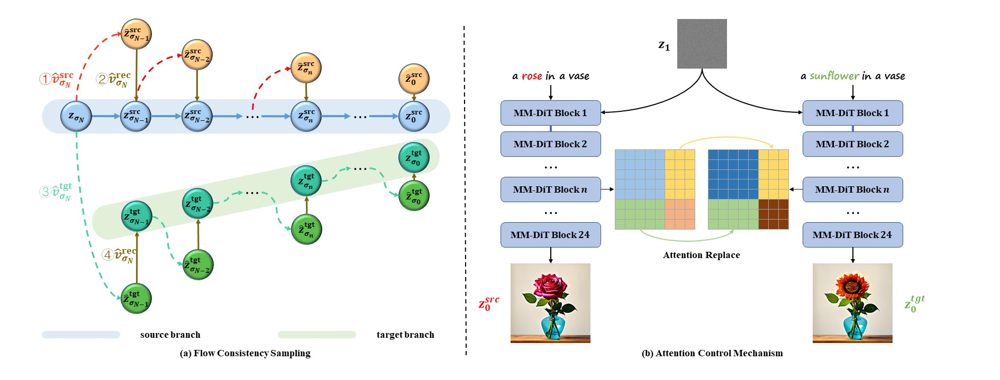
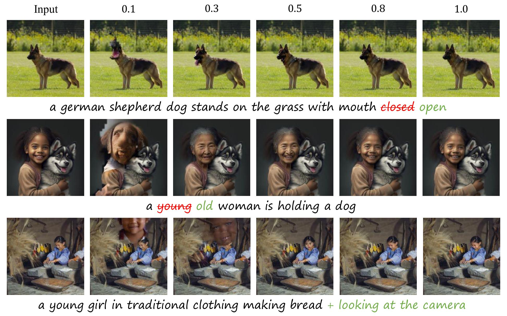
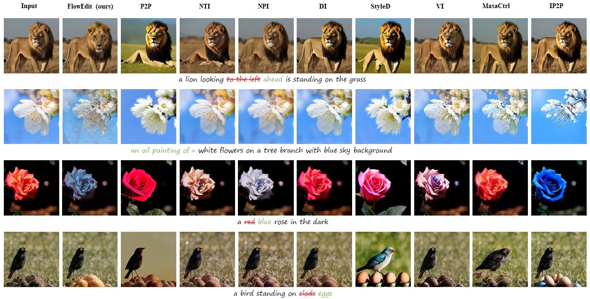

# Inversion-Free Image Editing via Rectified Flow

<center><a href="mailto:pengzhw23@mail2.sysu.edu.cn">Zhengwei Peng</a>, <a href="mailto:yuech5@mail2.sysu.edu.cn">Conghan Yue</a>, <a href="mailto:duant3@mail2.sysu.edu.cn">Tong Duan</a>, <a href="mailto:zhangdy27@mail.sysu.edu.cn">Dongyu Zhang</a>*</center>
<center>School of Computer Science and Engineering</center>
<center>Sun Yat-sen University, Guangzhou</center>



## Setup
```python
conda create -n flowedit python=3.10
pip install -r requirements.txt
```
Note that installing the corresponding version of PyTorch or other third-party packages based on the NVIDIA driver version you are using.

Our code utilizes the pre-trained [Stable Diffusion 3](https://stability.ai/news/stable-diffusion-3) for inference. You can click [here](https://huggingface.co/stabilityai/stable-diffusion-3-medium) to download the checkpoint.

## Inference
```bash
python flowedit.py \
    --image_filename "/path/source_image" \
    --source_prompt "source prompt" \
    --target_prompt "target prompt" \
    --source_blend_words "source blend words" \
    --target_blend_words "target blend words" 
```

You can modify the configuration file `configs/edit.yaml` to specify more advanced parameters. A good compromise between controllability and consistency can be achieved by adjusting `cross_end_step`, as shown in the figure below.



## Evaluation
* Evaluation on PIE-Bench

You can modify the configuration file `configs/evaluate_pie.yaml` to specify the model path, dataset path, and output path.

```bash
python run_pie_benchmark.py

cd evaluation
python evaluate_pie.py \
    --annotation_mapping_file "annotation of pie-bench" \
    --src_image_folder "annotation images of pie-bench" \
    --result_path "result save path" \
    --tgt_methods flowedit
```

* Evaluation on AFHQ

You can modify the configuration file `configs/evaluate_afhq.yaml` to specify the model path, dataset path, and output path.

```bash
python run_afhq_benchmark.py

cd evaluation
python evaluate_afhq.py \
    --src_image_folder "annotation images of pie-bench" \
    --result_path "result save path" \
    --tgt_methods flowedit
```



## Gradio Playground
We implement interactive editor on web with Gradio, you can launch it via:

```bash
python app_flowedit.py
```
